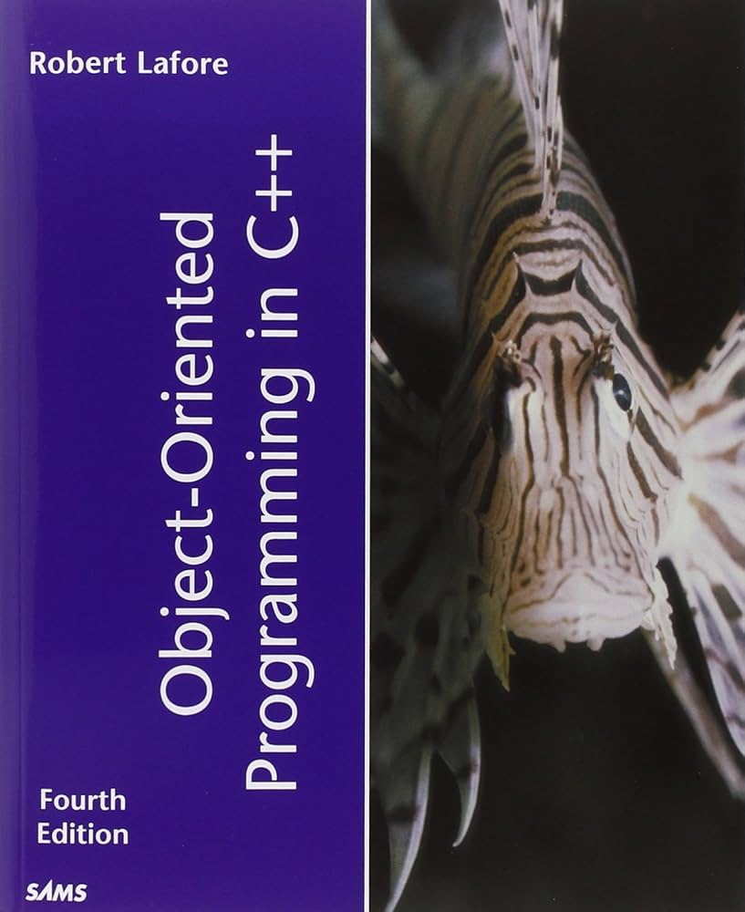
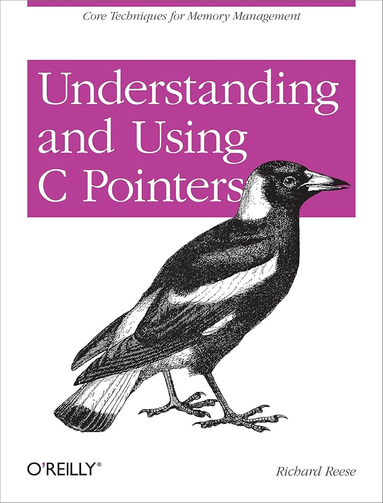
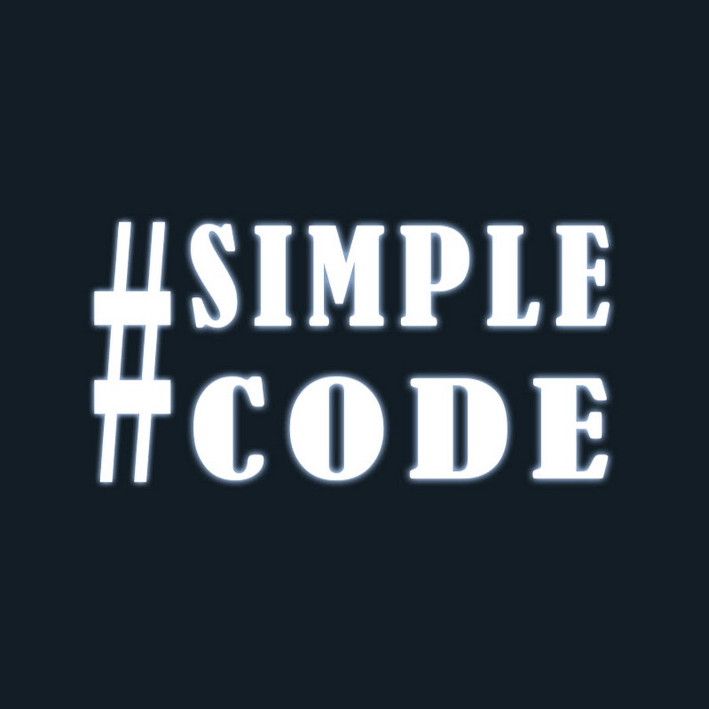

# Tutoral

Repository definitiva in cui conserverò tutto il codice sorgente dei libri che leggo e dei tutorial che seguo.

## Linguaggi studiati

	
	
	
	
	
	
	

> [!NOTE]
> Le icone di colore red indicano che nella repository sono presenti dei file correlati e, quindi, possono essere cliccate per visualizzarli.	

## Da rivedere

- [ ] PHP
- [ ] Python

## Sources

<table>
	<tr>
		<th>Language</th>
		<th>Source</th>
		<th>In</th>
	</tr>
	<tr>
		<td rowspan="4">C++</td>
		<td><a href="https://www.google.com/search?q=book:Object+Oriented+Programming+in+C%2B%2B">Object Oriented Programming in C++</a></td>
		<td>EN</td>
	</tr>
	<tr>
		<td><a href="https://www.google.com/search?q=book%3AUnderstanding+and+Using+C+Pointers">Understanding and Using C Pointers</a></td>
		<td>EN</td>
	</tr>
	<tr>
		<td>The Chermo</td>
		<td>EN</td>
	</tr>
	<tr>
		<td>#SimpleCode</td>
		<td>RU</td>
	</tr>
	<tr>
		<td>HTML</td>
		<td><a href="https://youtu.be/kUMe1FH4CHE">Dave Gray</a></td>
		<td>EN</td>
	</tr>
	<tr>
		<td>CSS</td>
		<td><a href="https://youtu.be/OXGznpKZ_sA">Dave Gray</a></td>
		<td>EN</td>
	</tr>
	<tr>
		<td>GIT</td>
		<td><a href="https://www.youtube.com/watch?v=8JJ101D3knE">Mosh Hamedani</a></td>
		<td>EN</td>
	</tr>
	<tr>
		<td>ZHS</td>
		<td><a href="https://github.com/0nn0/terminal-mac-cheatsheet">terminal-mac-cheatsheet</a></td>
		<td>EN</td>
	</tr>
</table>

 

## Struttura

### CPP
<pre style="font-family: monospace;">
├── CPP/
│   ├── book/
│   │   ├── Object Oriented Programming in C++/
│   │   │   ├── <a href="CPP/book/Object%20Oriented%20Programming%20in%20C++/Casts.cpp">Casts.cpp</a>
│   │   │   ├── arrays/
│   │   │   │   ├── <a href="CPP/book/Object%20Oriented%20Programming%20in%20C++/arrays/A%20User-Defined%20String%20Type.cpp">A User-Defined String Type.cpp</a>
│   │   │   │   ├── <a href="CPP/book/Object%20Oriented%20Programming%20in%20C++/arrays/Array%20Fundamentals.cpp">Array Fundamentals.cpp</a>
│   │   │   │   ├── <a href="CPP/book/Object%20Oriented%20Programming%20in%20C++/arrays/Arrays%20as%20Class%20Member%20Data.cpp">Arrays as Class Member Data.cpp</a>
│   │   │   │   ├── <a href="CPP/book/Object%20Oriented%20Programming%20in%20C++/arrays/Arrays%20of%20Cards.cpp">Arrays of Cards.cpp</a>
│   │   │   │   ├── <a href="CPP/book/Object%20Oriented%20Programming%20in%20C++/arrays/Arrays%20of%20English%20Distances.cpp">Arrays of English Distances.cpp</a>
│   │   │   │   ├── <a href="CPP/book/Object%20Oriented%20Programming%20in%20C++/arrays/Arrays%20of%20Structures.cpp">Arrays of Structures.cpp</a>
│   │   │   │   ├── <a href="CPP/book/Object%20Oriented%20Programming%20in%20C++/arrays/Averaging%20Array%20Elements.cpp">Averaging Array Elements.cpp</a>
│   │   │   │   ├── <a href="CPP/book/Object%20Oriented%20Programming%20in%20C++/arrays/Initializing%20Arrays.cpp">Initializing Arrays.cpp</a>
│   │   │   │   ├── <a href="CPP/book/Object%20Oriented%20Programming%20in%20C++/arrays/Initializing%20Multidimensional%20Arrays.cpp">Initializing Multidimensional Arrays.cpp</a>
│   │   │   │   ├── <a href="CPP/book/Object%20Oriented%20Programming%20in%20C++/arrays/Input%20Output%20with%20string%20Objects.cpp">Input Output with string Objects.cpp</a>
│   │   │   │   ├── <a href="CPP/book/Object%20Oriented%20Programming%20in%20C++/arrays/Multidimensional%20Arrays.cpp">Multidimensional Arrays.cpp</a>
│   │   │   │   └── <a href="CPP/book/Object%20Oriented%20Programming%20in%20C++/arrays/Passing%20Arrays%20to%20Functions.cpp">Passing Arrays to Functions.cpp</a>
│   │   │   ├── classes/
│   │   │   │   ├── <a href="CPP/book/Object%20Oriented%20Programming%20in%20C++/classes/A%20Card-Game%20Example.cpp">A Card-Game Example.cpp</a>
│   │   │   │   ├── <a href="CPP/book/Object%20Oriented%20Programming%20in%20C++/classes/An%20Example%20of%20Static%20Class%20Data.cpp">An Example of Static Class Data.cpp</a>
│   │   │   │   ├── <a href="CPP/book/Object%20Oriented%20Programming%20in%20C++/classes/Constructor%20(A%20Counter%20Example).cpp">Constructor (A Counter Example).cpp</a>
│   │   │   │   ├── <a href="CPP/book/Object%20Oriented%20Programming%20in%20C++/classes/Objects%20as%20Data%20Types.cpp">Objects as Data Types.cpp</a>
│   │   │   │   ├── <a href="CPP/book/Object%20Oriented%20Programming%20in%20C++/classes/Objects%20as%20Function%20Arguments.cpp">Objects as Function Arguments.cpp</a>
│   │   │   │   ├── Operator overloading/
│   │   │   │   │   ├── <a href="CPP/book/Object%20Oriented%20Programming%20in%20C++/classes/Operator%20overloading/Arithmetic%20Assignment%20Operators.cpp">Arithmetic Assignment Operators.cpp</a>
│   │   │   │   │   ├── <a href="CPP/book/Object%20Oriented%20Programming%20in%20C++/classes/Operator%20overloading/Arithmetic%20Operators.cpp">Arithmetic Operators.cpp</a>
│   │   │   │   │   ├── <a href="CPP/book/Object%20Oriented%20Programming%20in%20C++/classes/Operator%20overloading/Comparing%20Distances.cpp">Comparing Distances.cpp</a>
│   │   │   │   │   ├── <a href="CPP/book/Object%20Oriented%20Programming%20in%20C++/classes/Operator%20overloading/Comparing%20Strings.cpp">Comparing Strings.cpp</a>
│   │   │   │   │   ├── <a href="CPP/book/Object%20Oriented%20Programming%20in%20C++/classes/Operator%20overloading/Concatenating%20Strings.cpp">Concatenating Strings.cpp</a>
│   │   │   │   │   ├── <a href="CPP/book/Object%20Oriented%20Programming%20in%20C++/classes/Operator%20overloading/Conversion%20Between%20C-Strings%20and%20String%20Objects.cpp">Conversion Between C-Strings and String Objects.cpp</a>
│   │   │   │   │   ├── <a href="CPP/book/Object%20Oriented%20Programming%20in%20C++/classes/Operator%20overloading/Conversions%20Between%20Objects%20and%20Basic%20Types.cpp">Conversions Between Objects and Basic Types.cpp</a>
│   │   │   │   │   ├── <a href="CPP/book/Object%20Oriented%20Programming%20in%20C++/classes/Operator%20overloading/Nameless%20Temporary%20Objects.cpp">Nameless Temporary Objects.cpp</a>
│   │   │   │   │   ├── <a href="CPP/book/Object%20Oriented%20Programming%20in%20C++/classes/Operator%20overloading/Operator%20Return%20Values.cpp">Operator Return Values.cpp</a>
│   │   │   │   │   ├── <a href="CPP/book/Object%20Oriented%20Programming%20in%20C++/classes/Operator%20overloading/Overloading%20Unary%20Operators.cpp">Overloading Unary Operators.cpp</a>
│   │   │   │   │   ├── <a href="CPP/book/Object%20Oriented%20Programming%20in%20C++/classes/Operator%20overloading/Postfix%20Notation.cpp">Postfix Notation.cpp</a>
│   │   │   │   │   └── The Subscript Operator ([])/
│   │   │   │   │       ├── <a href="CPP/book/Object%20Oriented%20Programming%20in%20C++/classes/Operator%20overloading/The%20Subscript%20Operator%20([])/Separate%20get()%20and%20put()%20Functions.cpp">Separate get() and put() Functions.cpp</a>
│   │   │   │   │       └── <a href="CPP/book/Object%20Oriented%20Programming%20in%20C++/classes/Operator%20overloading/The%20Subscript%20Operator%20([])/Single%20access()%20Function%20Returning%20by%20Reference.cpp">Single access() Function Returning by Reference.cpp</a>
│   │   │   │   ├── <a href="CPP/book/Object%20Oriented%20Programming%20in%20C++/classes/Returning%20Objects%20from%20Functions.cpp">Returning Objects from Functions.cpp</a>
│   │   │   │   ├── <a href="CPP/book/Object%20Oriented%20Programming%20in%20C++/classes/Simple%20Class.cpp">Simple Class.cpp</a>
│   │   │   │   ├── <a href="CPP/book/Object%20Oriented%20Programming%20in%20C++/classes/The%20Default%20Copy%20Constructor.cpp">The Default Copy Constructor.cpp</a>
│   │   │   │   └── <a href="CPP/book/Object%20Oriented%20Programming%20in%20C++/classes/Widget%20Parts%20as%20Objects.cpp">Widget Parts as Objects.cpp</a>
│   │   │   ├── enumeration/
│   │   │   │   ├── <a href="CPP/book/Object%20Oriented%20Programming%20in%20C++/enumeration/Enumeration%20(days%20of%20the%20week).cpp">Enumeration (days of the week).cpp</a>
│   │   │   │   ├── <a href="CPP/book/Object%20Oriented%20Programming%20in%20C++/enumeration/Enumeration%20(organizing%20the%20cards).cpp">Enumeration (organizing the cards).cpp</a>
│   │   │   │   └── <a href="CPP/book/Object%20Oriented%20Programming%20in%20C++/enumeration/Enumeration%20(word%20count).cpp">Enumeration (word count).cpp</a>
│   │   │   ├── functions/
│   │   │   │   ├── <a href="CPP/book/Object%20Oriented%20Programming%20in%20C++/functions/Const%20Function%20Arguments.cpp">Const Function Arguments.cpp</a>
│   │   │   │   ├── <a href="CPP/book/Object%20Oriented%20Programming%20in%20C++/functions/Functions%20(a%20more%20complex%20pass%20by%20reference).cpp">Functions (a more complex pass by reference).cpp</a>
│   │   │   │   ├── <a href="CPP/book/Object%20Oriented%20Programming%20in%20C++/functions/Functions%20(default%20arguments).cpp">Functions (default arguments).cpp</a>
│   │   │   │   ├── <a href="CPP/book/Object%20Oriented%20Programming%20in%20C++/functions/Functions%20(overloading).cpp">Functions (overloading).cpp</a>
│   │   │   │   ├── <a href="CPP/book/Object%20Oriented%20Programming%20in%20C++/functions/Functions%20(overloading,%20diff%20arguments).cpp">Functions (overloading, diff arguments).cpp</a>
│   │   │   │   ├── <a href="CPP/book/Object%20Oriented%20Programming%20in%20C++/functions/Functions%20(passing%20a%20structure).cpp">Functions (passing a structure).cpp</a>
│   │   │   │   ├── <a href="CPP/book/Object%20Oriented%20Programming%20in%20C++/functions/Functions%20(passing%20constants).cpp">Functions (passing constants).cpp</a>
│   │   │   │   ├── <a href="CPP/book/Object%20Oriented%20Programming%20in%20C++/functions/Functions%20(passing%20simple%20data%20types%20by%20reference).cpp">Functions (passing simple data types by reference).cpp</a>
│   │   │   │   ├── <a href="CPP/book/Object%20Oriented%20Programming%20in%20C++/functions/Functions%20(passing%20variables).cpp">Functions (passing variables).cpp</a>
│   │   │   │   ├── <a href="CPP/book/Object%20Oriented%20Programming%20in%20C++/functions/Functions%20(recursion).cpp">Functions (recursion).cpp</a>
│   │   │   │   ├── <a href="CPP/book/Object%20Oriented%20Programming%20in%20C++/functions/Functions%20(return%20structure%20variables).cpp">Functions (return structure variables).cpp</a>
│   │   │   │   ├── <a href="CPP/book/Object%20Oriented%20Programming%20in%20C++/functions/Functions%20(returning%20values).cpp">Functions (returning values).cpp</a>
│   │   │   │   ├── <a href="CPP/book/Object%20Oriented%20Programming%20in%20C++/functions/Inline%20functions.cpp">Inline functions.cpp</a>
│   │   │   │   ├── <a href="CPP/book/Object%20Oriented%20Programming%20in%20C++/functions/Returning%20by%20Reference.cpp">Returning by Reference.cpp</a>
│   │   │   │   ├── <a href="CPP/book/Object%20Oriented%20Programming%20in%20C++/functions/Simple%20Functions.cpp">Simple Functions.cpp</a>
│   │   │   │   └── <a href="CPP/book/Object%20Oriented%20Programming%20in%20C++/functions/Static%20Local%20Variables.cpp">Static Local Variables.cpp</a>
│   │   │   ├── streams/
│   │   │   │   ├── <a href="CPP/book/Object%20Oriented%20Programming%20in%20C++/streams/Character%20I%20O.cpp">Character I O.cpp</a>
│   │   │   │   ├── <a href="CPP/book/Object%20Oriented%20Programming%20in%20C++/streams/I%20O%20with%20Multiple%20Objects.cpp">I O with Multiple Objects.cpp</a>
│   │   │   │   ├── Reading/
│   │   │   │   │   ├── <a href="CPP/book/Object%20Oriented%20Programming%20in%20C++/streams/Reading/Reading%20Data.cpp">Reading Data.cpp</a>
│   │   │   │   ├── <a href="CPP/book/Object%20Oriented%20Programming%20in%20C++/streams/Specifying%20the%20Offset.cpp">Specifying the Offset.cpp</a>
│   │   │   │   └── Writing/
│   │   │   │       ├── <a href="CPP/book/Object%20Oriented%20Programming%20in%20C++/streams/Writing/Strings%20with%20Embedded%20Blanks.cpp">Strings with Embedded Blanks.cpp</a>
│   │   │   │       ├── <a href="CPP/book/Object%20Oriented%20Programming%20in%20C++/streams/Writing/Writing%20Data.cpp">Writing Data.cpp</a>
│   │   │   │       ├── <a href="CPP/book/Object%20Oriented%20Programming%20in%20C++/streams/Writing/Writing%20an%20Object%20to%20Disk.cpp">Writing an Object to Disk.cpp</a>
│   │   │   ├── strings/
│   │   │   │   ├── C Strings/
│   │   │   │   │   ├── <a href="CPP/book/Object%20Oriented%20Programming%20in%20C++/strings/C%20Strings/Arrays%20of%20Strings.cpp">Arrays of Strings.cpp</a>
│   │   │   │   │   ├── <a href="CPP/book/Object%20Oriented%20Programming%20in%20C++/strings/C%20Strings/Avoiding%20Buffer%20Overflow.cpp">Avoiding Buffer Overflow.cpp</a>
│   │   │   │   │   ├── <a href="CPP/book/Object%20Oriented%20Programming%20in%20C++/strings/C%20Strings/Copying%20a%20String%20the%20Easy%20Way.cpp">Copying a String the Easy Way.cpp</a>
│   │   │   │   │   ├── <a href="CPP/book/Object%20Oriented%20Programming%20in%20C++/strings/C%20Strings/Copying%20a%20String%20the%20Hard%20Way.cpp">Copying a String the Hard Way.cpp</a>
│   │   │   │   │   ├── <a href="CPP/book/Object%20Oriented%20Programming%20in%20C++/strings/C%20Strings/Reading%20Embedded%20Blanks.cpp">Reading Embedded Blanks.cpp</a>
│   │   │   │   │   ├── <a href="CPP/book/Object%20Oriented%20Programming%20in%20C++/strings/C%20Strings/Reading%20Multiple%20Lines.cpp">Reading Multiple Lines.cpp</a>
│   │   │   │   │   ├── <a href="CPP/book/Object%20Oriented%20Programming%20in%20C++/strings/C%20Strings/String%20Constants.cpp">String Constants.cpp</a>
│   │   │   │   │   └── <a href="CPP/book/Object%20Oriented%20Programming%20in%20C++/strings/C%20Strings/Strings%20as%20Class%20Members.cpp">Strings as Class Members.cpp</a>
│   │   │   │   └── C++ Strings/
│   │   │   │       ├── <a href="CPP/book/Object%20Oriented%20Programming%20in%20C++/strings/C++%20Strings/Accessing%20Characters%20in%20string%20Objects.cpp">Accessing Characters in string Objects.cpp</a>
│   │   │   │       ├── <a href="CPP/book/Object%20Oriented%20Programming%20in%20C++/strings/C++%20Strings/C-String%20Variables.cpp">C-String Variables.cpp</a>
│   │   │   │       ├── <a href="CPP/book/Object%20Oriented%20Programming%20in%20C++/strings/C++%20Strings/Comparing%20string%20Objects.cpp">Comparing string Objects.cpp</a>
│   │   │   │       ├── <a href="CPP/book/Object%20Oriented%20Programming%20in%20C++/strings/C++%20Strings/Finding%20string%20Objects.cpp">Finding string Objects.cpp</a>
│   │   │   │       └── <a href="CPP/book/Object%20Oriented%20Programming%20in%20C++/strings/C++%20Strings/Modifying%20string%20Objects.cpp">Modifying string Objects.cpp</a>
│   │   │   └── struct/
│   │   │       ├── <a href="CPP/book/Object%20Oriented%20Programming%20in%20C++/struct/A%20Card%20Game%20Example.cpp">A Card Game Example.cpp</a>
│   │   │       ├── <a href="CPP/book/Object%20Oriented%20Programming%20in%20C++/struct/A%20Measurement%20Example.cpp">A Measurement Example.cpp</a>
│   │   │       ├── <a href="CPP/book/Object%20Oriented%20Programming%20in%20C++/struct/Initializing%20Structure%20Members.cpp">Initializing Structure Members.cpp</a>
│   │   │       ├── <a href="CPP/book/Object%20Oriented%20Programming%20in%20C++/struct/Structs.cpp">Structs.cpp</a>
│   │   │       └── <a href="CPP/book/Object%20Oriented%20Programming%20in%20C++/struct/Structures%20Within%20Structures.cpp">Structures Within Structures.cpp</a>
│   │   └── Understanding and Using C Pointers/
│   │       ├── <a href="CPP/book/Understanding%20and%20Using%20C%20Pointers/Adding%20an%20integer%20to%20a%20pointer.cpp">Adding an integer to a pointer.cpp</a>
│   │       ├── <a href="CPP/book/Understanding%20and%20Using%20C%20Pointers/Constant%20pointers%20to%20constans.cpp">Constant pointers to constans.cpp</a>
│   │       ├── <a href="CPP/book/Understanding%20and%20Using%20C%20Pointers/Constant%20pointers%20to%20nonconstants.cpp">Constant pointers to nonconstants.cpp</a>
│   │       ├── <a href="CPP/book/Understanding%20and%20Using%20C%20Pointers/Dereferencing%20a%20Pointer%20Using%20the%20Indirection%20Operator.cpp">Dereferencing a Pointer Using the Indirection Operator.cpp</a>
│   │       ├── <a href="CPP/book/Understanding%20and%20Using%20C%20Pointers/Displaying%20Pointer%20Values.cpp">Displaying Pointer Values.cpp</a>
│   │       ├── <a href="CPP/book/Understanding%20and%20Using%20C%20Pointers/Multiple%20Levels%20of%20Indirection.cpp">Multiple Levels of Indirection.cpp</a>
│   │       ├── <a href="CPP/book/Understanding%20and%20Using%20C%20Pointers/Pointer%20to%20(constant%20pointer%20to%20constant).cpp">Pointer to (constant pointer to constant).cpp</a>
│   │       ├── <a href="CPP/book/Understanding%20and%20Using%20C%20Pointers/Pointers%20to%20a%20constant.cpp">Pointers to a constant.cpp</a>
│   │       ├── <a href="CPP/book/Understanding%20and%20Using%20C%20Pointers/Substracting%20an%20integer%20from%20a%20pointer.cpp">Substracting an integer from a pointer.cpp</a>
│   │       └── <a href="CPP/book/Understanding%20and%20Using%20C%20Pointers/Subtracting%20two%20pointers.cpp">Subtracting two pointers.cpp</a>
│   └── youtube/
│       ├── arrays/
│       │   ├── <a href="CPP/youtube/arrays/Array-come-passarlo-nella-funzione.cpp">Array-come-passarlo-nella-funzione.cpp</a> (Creator: #SimpleCode)
│       │   ├── <a href="CPP/youtube/arrays/Arrays.cpp">Arrays.cpp</a> (Creator: The Cherno)
│       │   ├── <a href="CPP/youtube/arrays/Funzioni-con-array[OWN].cpp">Funzioni-con-array[OWN].cpp</a>
│       │   ├── <a href="CPP/youtube/arrays/Sorting.cpp">Sorting.cpp</a> (Creator: The Cherno)
│       │   └── Vector[sdynamic-arrays]/
│       │       └── <a href="CPP/youtube/arrays/Vector[sdynamic-arrays]/Vectors.cpp">Vectors.cpp</a> (Creator: The Cherno)
│       ├── classes/
│       │   ├── <a href="CPP/youtube/classes/Classes.cpp">Classes.cpp</a> (Creator: The Cherno)
│       │   ├── <a href="CPP/youtube/classes/Classes[write].cpp">Classes[write].cpp</a> (Creator: The Cherno)
│       │   └── SimpleCode/
│       │       ├── <a href="CPP/youtube/classes/SimpleCode/Che-cosa-sono-le-classi-esempio-2.cpp">Che-cosa-sono-le-classi-esempio-2.cpp</a> (Creator: #SimpleCode)
│       │       ├── <a href="CPP/youtube/classes/SimpleCode/Che-cosa-sono-le-classi.cpp">Che-cosa-sono-le-classi.cpp</a> (Creator: #SimpleCode)
│       │       ├── <a href="CPP/youtube/classes/SimpleCode/Classi-metodi-di-accesso.cpp">Classi-metodi-di-accesso.cpp</a> (Creator: #SimpleCode)
│       │       ├── <a href="CPP/youtube/classes/SimpleCode/Costruttori.cpp">Costruttori.cpp</a> (Creator: #SimpleCode)
│       │       ├── <a href="CPP/youtube/classes/SimpleCode/Distruttore-esempio-2.cpp">Distruttore-esempio-2.cpp</a> (Creator: #SimpleCode)
│       │       ├── <a href="CPP/youtube/classes/SimpleCode/Distuttore.cpp">Distuttore.cpp</a> (Creator: #SimpleCode)
│       │       ├── <a href="CPP/youtube/classes/SimpleCode/Metodi-e-funzini-delle-classi.cpp">Metodi-e-funzini-delle-classi.cpp</a> (Creator: #SimpleCode)
│       │       ├── <a href="CPP/youtube/classes/SimpleCode/Metodi-privati.cpp">Metodi-privati.cpp</a> (Creator: #SimpleCode)
│       │       ├── <a href="CPP/youtube/classes/SimpleCode/Ottenere-e-settare.cpp">Ottenere-e-settare.cpp</a> (Creator: #SimpleCode)
│       │       ├── <a href="CPP/youtube/classes/SimpleCode/Overloading-classes.cpp">Overloading-classes.cpp</a> (Creator: #SimpleCode)
│       │       └── <a href="CPP/youtube/classes/SimpleCode/Parola-chiave-#this.cpp">Parola-chiave-#this.cpp</a> (Creator: #SimpleCode)
│       ├── conditions/
│       ├── constructors/
│       │   └── <a href="CPP/youtube/constructors/Constructors.cpp">Constructors.cpp</a> (Creator: The Cherno)
│       ├── enumeration/
│       │   └── <a href="CPP/youtube/enumeration/Enum.cpp">Enum.cpp</a> (Creator: The Cherno)
│       ├── functions/
│       │   ├── <a href="CPP/youtube/functions/Fattoriale-con-ricursione.cpp">Fattoriale-con-ricursione.cpp</a> (Creator: #SimpleCode)
│       │   ├── <a href="CPP/youtube/functions/Overloading-delle-funzioni.cpp">Overloading-delle-funzioni.cpp</a> (Creator: #SimpleCode)
│       │   ├── <a href="CPP/youtube/functions/Parametri-predefiniti.cpp">Parametri-predefiniti.cpp</a> (Creator: #SimpleCode)
│       │   ├── <a href="CPP/youtube/functions/Prototipi-delle-funzioni.cpp">Prototipi-delle-funzioni.cpp</a> (Creator: #SimpleCode)
│       │   ├── <a href="CPP/youtube/functions/Ricorsione.cpp">Ricorsione.cpp</a> (Creator: #SimpleCode)
│       │   └── <a href="CPP/youtube/functions/Ternary-operators.cpp">Ternary-operators.cpp</a> (Creator: The Cherno)
│       ├── keywords and operators/
│       │   ├── <a href="CPP/youtube/keywords%20and%20operators/Auto-keyword.cpp">Auto-keyword.cpp</a> (Creator: The Cherno)
│       │   └── <a href="CPP/youtube/keywords%20and%20operators/New-e-Delete.cpp">New-e-Delete.cpp</a> (Creator: #SimpleCode)
│       ├── loops/
│       │   ├── <a href="CPP/youtube/loops/Ciclo-do-while.cpp">Ciclo-do-while.cpp</a> (Creator: #SimpleCode)
│       │   ├── <a href="CPP/youtube/loops/Ciclo-while.cpp">Ciclo-while.cpp</a> (Creator: #SimpleCode)
│       │   ├── <a href="CPP/youtube/loops/Control-flow-[continue_break_return].cpp">Control-flow-[continue_break_return].cpp</a> (Creator: The Cherno)
│       │   ├── <a href="CPP/youtube/loops/For-annidati-[nasted].cpp">For-annidati-[nasted].cpp</a> (Creator: #SimpleCode)
│       │   ├── <a href="CPP/youtube/loops/Goto.cpp">Goto.cpp</a> (Creator: #SimpleCode)
│       │   ├── <a href="CPP/youtube/loops/Range-based-for-loop.cpp">Range-based-for-loop.cpp</a> (Creator: Caleb Curry)
│       │   └── <a href="CPP/youtube/loops/Specialita-del-ciclo-for.cpp">Specialita-del-ciclo-for.cpp</a> (Creator: #SimpleCode)
│       ├── pointers/
│       │   ├── <a href="CPP/youtube/pointers/Aritmetica-dei-puntatori.cpp">Aritmetica-dei-puntatori.cpp</a> (Creator: #SimpleCode)
│       │   ├── <a href="CPP/youtube/pointers/NULL-e-nullptr.cpp">NULL-e-nullptr.cpp</a> (Creator: #SimpleCode)
│       │   ├── <a href="CPP/youtube/pointers/Passaggio-per-reference-alla-funziona.cpp">Passaggio-per-reference-alla-funziona.cpp</a> (Creator: #SimpleCode)
│       │   ├── <a href="CPP/youtube/pointers/Pointers.cpp">Pointers.cpp</a> (Creator: The Cherno)
│       │   ├── <a href="CPP/youtube/pointers/Puntatori-nelle-funzioni.cpp">Puntatori-nelle-funzioni.cpp</a> (Creator: #SimpleCode)
│       │   ├── <a href="CPP/youtube/pointers/Puntatori.cpp">Puntatori.cpp</a> (Creator: #SimpleCode)
│       │   ├── <a href="CPP/youtube/pointers/Return-piu-valori-via-reference.cpp">Return-piu-valori-via-reference.cpp</a> (Creator: #SimpleCode)
│       │   ├── <a href="CPP/youtube/pointers/Return-piu-valori.cpp">Return-piu-valori.cpp</a> (Creator: #SimpleCode)
│       │   └── <a href="CPP/youtube/pointers/Riferimento.cpp">Riferimento.cpp</a> (Creator: #SimpleCode)
│       ├── strings/
│       │   ├── <a href="CPP/youtube/strings/Escape-sequences.cpp">Escape-sequences.cpp</a> (Creator: #SimpleCode)
│       │   ├── <a href="CPP/youtube/strings/String-API.cpp">String-API.cpp</a> (Creator: Bro Code)
│       │   └── <a href="CPP/youtube/strings/Strings.cpp">Strings.cpp</a> (Creator: The Cherno)
│       ├── templates/
│       │   ├── <a href="CPP/youtube/templates/Classes.cpp">Classes.cpp</a> (Creator: The Cherno)
│       │   ├── <a href="CPP/youtube/templates/Functions.cpp">Functions.cpp</a> (Creator: The Cherno)
│       │   └── <a href="CPP/youtube/templates/Funzioni-con-template.cpp">Funzioni-con-template.cpp</a> (Creator: #SimpleCode)
│       ├── threads/
│       └── variables/
│           └── <a href="CPP/youtube/variables/Area-visiva[variabili_globali_e_locali].cpp">Area-visiva[variabili_globali_e_locali].cpp</a> (Creator: #CodeSimple)
</pre>
### HTML
<pre style="font-family: monospace;">
├── HTML/
│   └── youtube/
│       └── Dave-Gray-course/
│           ├── DAY-1/
│           │   ├── add-links/
│           │   │   ├── <a href="HTML/youtube/Dave-Gray-course/DAY-1/add-links/index.html">index.html</a>
│           │   │   └── <a href="HTML/youtube/Dave-Gray-course/DAY-1/add-links/oltre.html">oltre.html</a>
│           │   ├── getting-started/
│           │   │   └── <a href="HTML/youtube/Dave-Gray-course/DAY-1/getting-started/index.html">index.html</a>
│           │   ├── head-element/
│           │   │   ├── <a href="HTML/youtube/Dave-Gray-course/DAY-1/head-element/index.html">index.html</a>
│           │   │   └── <a href="HTML/youtube/Dave-Gray-course/DAY-1/head-element/main.css">main.css</a>
│           │   ├── list-types/
│           │   │   └── <a href="HTML/youtube/Dave-Gray-course/DAY-1/list-types/index.html">index.html</a>
│           │   └── text-basics/
│           │       └── <a href="HTML/youtube/Dave-Gray-course/DAY-1/text-basics/index.html">index.html</a>
│           ├── DAY-2/
│           │   ├── add-images/
│           │   │   ├── img/
│           │   │   └── <a href="HTML/youtube/Dave-Gray-course/DAY-2/add-images/index.html">index.html</a>
│           │   ├── create-tables/
│           │   │   └── <a href="HTML/youtube/Dave-Gray-course/DAY-2/create-tables/index.html">index.html</a>
│           │   ├── forms-and-inputs/
│           │   │   └── <a href="HTML/youtube/Dave-Gray-course/DAY-2/forms-and-inputs/index.html">index.html</a>
│           │   └── semantic-tags/
│           │       └── <a href="HTML/youtube/Dave-Gray-course/DAY-2/semantic-tags/index.html">index.html</a>
</pre>
### CSS
<pre style="font-family: monospace;">
├── CSS/
│   ├── MDN-DOCS/
│   │   ├── CSS-building-blocks/
│   │   │   └── CSS-selectors/
│   │   └── CSS-first-steps/
│   │       ├── Getting-started-with-CSS/
│   │       │   ├── <a href="CSS/MDN-DOCS/CSS-first-steps/Getting-started-with-CSS/index.html">index.html</a>
│   │       │   └── <a href="CSS/MDN-DOCS/CSS-first-steps/Getting-started-with-CSS/style.css">style.css</a>
│   │       ├── How-CSS-is-structured/
│   │       │   ├── Inline-stylesheet/
│   │       │   │   ├── <a href="CSS/MDN-DOCS/CSS-first-steps/How-CSS-is-structured/Inline-stylesheet/index.html">index.html</a>
│   │       │   │   └── <a href="CSS/MDN-DOCS/CSS-first-steps/How-CSS-is-structured/Inline-stylesheet/style.css">style.css</a>
│   │       │   ├── Internal-stylesheet/
│   │       │   │   └── <a href="CSS/MDN-DOCS/CSS-first-steps/How-CSS-is-structured/Internal-stylesheet/index.html">index.html</a>
│   │       │   ├── Intro/
│   │       │   │   ├── <a href="CSS/MDN-DOCS/CSS-first-steps/How-CSS-is-structured/Intro/index.html">index.html</a>
│   │       │   │   └── <a href="CSS/MDN-DOCS/CSS-first-steps/How-CSS-is-structured/Intro/style.css">style.css</a>
│   │       │   └── Playing-with-CSS/
│   │       │       ├── <a href="CSS/MDN-DOCS/CSS-first-steps/How-CSS-is-structured/Playing-with-CSS/index.html">index.html</a>
│   │       │       └── <a href="CSS/MDN-DOCS/CSS-first-steps/How-CSS-is-structured/Playing-with-CSS/style.css">style.css</a>
│   │       ├── How-CSS-works/
│   │       │   ├── <a href="CSS/MDN-DOCS/CSS-first-steps/How-CSS-works/index.html">index.html</a>
│   │       │   └── <a href="CSS/MDN-DOCS/CSS-first-steps/How-CSS-works/style.css">style.css</a>
│   │       └── Styling-a-biography-page/
│   │           ├── <a href="CSS/MDN-DOCS/CSS-first-steps/Styling-a-biography-page/index.html">index.html</a>
│   │           └── <a href="CSS/MDN-DOCS/CSS-first-steps/Styling-a-biography-page/style.css">style.css</a>
│   ├── other/
│   │   └── <a href="CSS/other/position.html">position.html</a>
│   └── youtube/
│       └── Dave-Gray-course/
│           ├── DAY-1/
│           │   ├── 1_start-here/
│           │   │   ├── <a href="CSS/youtube/Dave-Gray-course/DAY-1/1_start-here/index.html">index.html</a>
│           │   │   └── <a href="CSS/youtube/Dave-Gray-course/DAY-1/1_start-here/style.css">style.css</a>
│           │   ├── 2_selectors/
│           │   │   ├── <a href="CSS/youtube/Dave-Gray-course/DAY-1/2_selectors/index.html">index.html</a>
│           │   │   └── <a href="CSS/youtube/Dave-Gray-course/DAY-1/2_selectors/style.css">style.css</a>
│           │   ├── 3_colors/
│           │   │   ├── <a href="CSS/youtube/Dave-Gray-course/DAY-1/3_colors/index.html">index.html</a>
│           │   │   └── <a href="CSS/youtube/Dave-Gray-course/DAY-1/3_colors/style.css">style.css</a>
│           │   └── 4_units-and-sizes/
│           │       ├── <a href="CSS/youtube/Dave-Gray-course/DAY-1/4_units-and-sizes/index.html">index.html</a>
│           │       └── <a href="CSS/youtube/Dave-Gray-course/DAY-1/4_units-and-sizes/style.css">style.css</a>
│           ├── DAY-2/
│           │   ├── 5_box-model/
│           │   │   ├── <a href="CSS/youtube/Dave-Gray-course/DAY-2/5_box-model/index.html">index.html</a>
│           │   │   └── <a href="CSS/youtube/Dave-Gray-course/DAY-2/5_box-model/style.css">style.css</a>
│           │   ├── 6_typography/
│           │   │   ├── <a href="CSS/youtube/Dave-Gray-course/DAY-2/6_typography/idnex.html">idnex.html</a>
│           │   │   └── <a href="CSS/youtube/Dave-Gray-course/DAY-2/6_typography/style.css">style.css</a>
│           │   ├── 7_styling-links/
│           │   │   ├── <a href="CSS/youtube/Dave-Gray-course/DAY-2/7_styling-links/about.html">about.html</a>
│           │   │   ├── <a href="CSS/youtube/Dave-Gray-course/DAY-2/7_styling-links/index.html">index.html</a>
│           │   │   ├── <a href="CSS/youtube/Dave-Gray-course/DAY-2/7_styling-links/more.html">more.html</a>
│           │   │   └── <a href="CSS/youtube/Dave-Gray-course/DAY-2/7_styling-links/style.css">style.css</a>
│           │   ├── 8_list-styles/
│           │   │   ├── <a href="CSS/youtube/Dave-Gray-course/DAY-2/8_list-styles/index.html">index.html</a>
│           │   │   └── <a href="CSS/youtube/Dave-Gray-course/DAY-2/8_list-styles/style.css">style.css</a>
│           │   └── 9_mini-project/
│           │       ├── <a href="CSS/youtube/Dave-Gray-course/DAY-2/9_mini-project/index.html">index.html</a>
│           │       └── <a href="CSS/youtube/Dave-Gray-course/DAY-2/9_mini-project/style.css">style.css</a>
│           ├── DAY-3/
│           │   ├── 10_display/
│           │   │   ├── <a href="CSS/youtube/Dave-Gray-course/DAY-3/10_display/index.html">index.html</a>
│           │   │   └── <a href="CSS/youtube/Dave-Gray-course/DAY-3/10_display/style.css">style.css</a>
│           │   ├── 11_floats/
│           │   │   ├── <a href="CSS/youtube/Dave-Gray-course/DAY-3/11_floats/index.html">index.html</a>
│           │   │   └── <a href="CSS/youtube/Dave-Gray-course/DAY-3/11_floats/style.css">style.css</a>
│           │   ├── 12_columns/
│           │   │   ├── <a href="CSS/youtube/Dave-Gray-course/DAY-3/12_columns/index.html">index.html</a>
│           │   │   └── <a href="CSS/youtube/Dave-Gray-course/DAY-3/12_columns/style.css">style.css</a>
│           │   └── 13_position/
│           │       ├── 01/
│           │       │   ├── <a href="CSS/youtube/Dave-Gray-course/DAY-3/13_position/01/index.html">index.html</a>
│           │       │   └── <a href="CSS/youtube/Dave-Gray-course/DAY-3/13_position/01/style.css">style.css</a>
│           │       └── 02/
│           │           ├── <a href="CSS/youtube/Dave-Gray-course/DAY-3/13_position/02/index.html">index.html</a>
│           │           └── <a href="CSS/youtube/Dave-Gray-course/DAY-3/13_position/02/style.css">style.css</a>
│           ├── DAY-4/
│           │   ├── 14_flexbox/
│           │   │   ├── <a href="CSS/youtube/Dave-Gray-course/DAY-4/14_flexbox/index.html">index.html</a>
│           │   │   └── <a href="CSS/youtube/Dave-Gray-course/DAY-4/14_flexbox/style.css">style.css</a>
│           │   └── 15_grid-layout/
│           │       ├── Fireship/
│           │       │   ├── Grid-1/
│           │       │   │   ├── <a href="CSS/youtube/Dave-Gray-course/DAY-4/15_grid-layout/Fireship/Grid-1/index.html">index.html</a>
│           │       │   │   └── <a href="CSS/youtube/Dave-Gray-course/DAY-4/15_grid-layout/Fireship/Grid-1/style.css">style.css</a>
│           │       │   └── Grid-2/
│           │       │       ├── <a href="CSS/youtube/Dave-Gray-course/DAY-4/15_grid-layout/Fireship/Grid-2/index.html">index.html</a>
│           │       │       └── <a href="CSS/youtube/Dave-Gray-course/DAY-4/15_grid-layout/Fireship/Grid-2/style.css">style.css</a>
│           │       ├── PF/
│           │       │   ├── <a href="CSS/youtube/Dave-Gray-course/DAY-4/15_grid-layout/PF/index.html">index.html</a>
│           │       │   └── <a href="CSS/youtube/Dave-Gray-course/DAY-4/15_grid-layout/PF/style.css">style.css</a>
│           │       └── Tutorial/
│           │           ├── <a href="CSS/youtube/Dave-Gray-course/DAY-4/15_grid-layout/Tutorial/index.html">index.html</a>
│           │           └── <a href="CSS/youtube/Dave-Gray-course/DAY-4/15_grid-layout/Tutorial/style.css">style.css</a>
│           ├── DAY-5/
│           │   ├── 16_images/
│           │   │   ├── img/
│           │   │   ├── <a href="CSS/youtube/Dave-Gray-course/DAY-5/16_images/index.html">index.html</a>
│           │   │   └── <a href="CSS/youtube/Dave-Gray-course/DAY-5/16_images/style.css">style.css</a>
│           │   └── 17_media-queries/
│           │       ├── <a href="CSS/youtube/Dave-Gray-course/DAY-5/17_media-queries/index.html">index.html</a>
│           │       └── <a href="CSS/youtube/Dave-Gray-course/DAY-5/17_media-queries/style.css">style.css</a>
</pre>